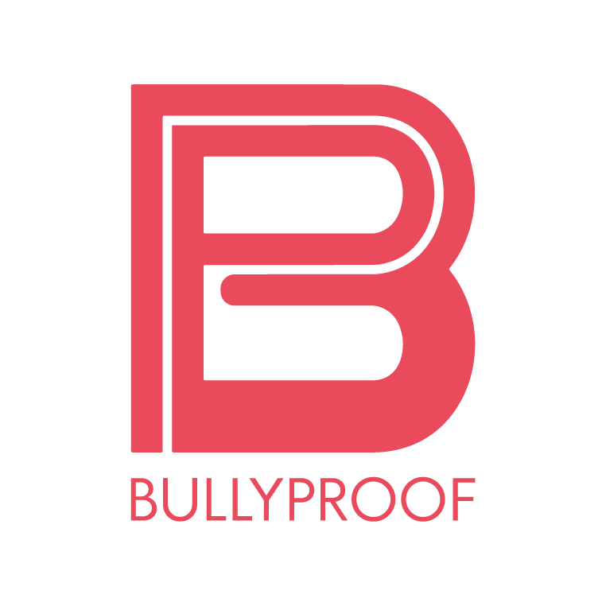

<!-- inserting logo to insert logo here we need to add the logo to the repo and then add the link to the logo here
-->

# Bully Proof Hockey Foundation

The Bully Proof Hokey Foundation is a non-profit organization dedicated to promoting positive behavior and ending bullying in the hockey community. Our mission is to create a culture of respect and inclusion in the sport, where everyone feels safe, respected, and included, regardless of their background or abilities.

## About Us

We provide educational programs, training sessions, and resources to raise awareness about the negative impact of bullying and to help individuals, families, and communities prevent and respond to it. By working together with parents, coaches, players, and other organizations, we aim to create a safer and more supportive environment for everyone involved in hockey.

## Team

Our campaign has a team of five dedicated individuals who are passionate about our mission:

- Krystal: Project Manager
- Pablo: Motion Designer
- Ishpreet: Graphic Designer
- Hiral: Front-end Developer
- Cristine: Back-end Developer

## Technologies

Our website is built using the following technologies:

- HTML
- CSS
- PHP
- JavaScript
- SQL (for event section)
- tawk.io (for chat bot integration)

## Get Involved

Thank you for your interest in our organization and for supporting our mission to end bullying in the hockey community. To learn more about our programs and how you can get involved, please visit our website at bullyproof.hiralshahh.com and follow us on social media.

## Donate

If you would like to support our mission, please consider making a donation through our GoFundMe page: 
 
<a target="_blank" href="https://gofund.me/77e12727">Make a Donation</a>

